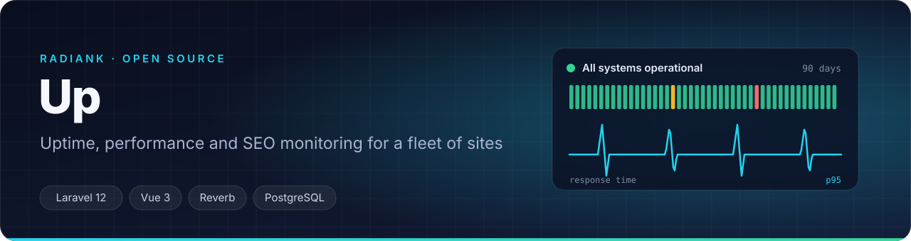
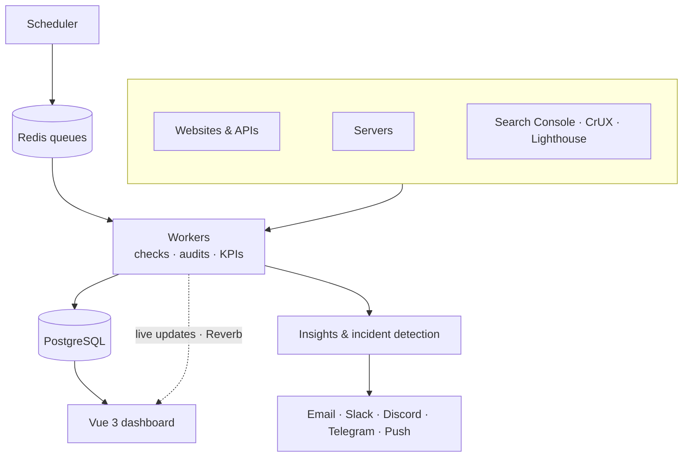

<p align="center">
  
</p>

<p align="center">
  <a href="LICENSE"></a>
  
  
  
  
  
</p>

<p align="center">
  <a href="#highlights">Highlights</a> ·
  <a href="#architecture">Architecture</a> ·
  <a href="#quick-start">Quick start</a> ·
  <a href="#cli">CLI</a> ·
  <a href="#api">API</a> ·
  <a href="#observability">Observability</a>
</p>

---

**Up** started as a self-hosted alternative to UptimeRobot and Pingdom. It grew into the operations cockpit I use every day to run a fleet of more than a hundred websites and applications: uptime, performance, SEO health, servers, deployments and incidents, in one place, with alerts that arrive before the client calls.

## Highlights

<table>
<tr>
<td width="50%" valign="top">

### Monitoring
- HTTP, DNS, ping and TCP port checks, with expected status and keyword detection
- Functional checks: page content, redirects, `robots.txt`, sitemaps
- SSL certificate and domain expiry tracking
- Server health: load, CPU and disk, with per-core thresholds
- Public status pages with 90-day uptime bars and embeddable SVG badges

</td>
<td width="50%" valign="top">

### Performance & SEO
- Daily Lighthouse audits and Chrome UX Report (CrUX) field data
- Search Console KPIs with regression detection
- Striking-distance keywords, content decay and zombie pages
- Broken pages and redirects, hreflang audits, outdated CMS versions
- Cache warming runs after each deploy

</td>
</tr>
<tr>
<td width="50%" valign="top">

### Operations
- Incidents, triage inbox and action plan across the whole fleet
- Post-deploy smoke tests with automatic rollback
- Weekly digests and PDF site reports
- AI-assisted diagnosis: each incident can generate a ready-to-run fix prompt for a coding agent
- Task sync with a self-hosted Kanban

</td>
<td width="50%" valign="top">

### Alerts & integrations
- Email, Slack, Discord, Telegram, webhooks and web push
- Response-time thresholds with consecutive-check logic to avoid noise
- Real-time dashboard over WebSockets (Laravel Reverb)
- Installable PWA with push notifications
- Multi-team workspaces with data isolation

</td>
</tr>
</table>

## Architecture



## Quick start

```bash
git clone https://github.com/BBerthod/up-monitor.git
cd up-monitor
cp .env.example .env
docker compose up -d

docker compose exec app php artisan key:generate
docker compose exec app php artisan migrate
docker compose exec app php artisan webpush:vapid   # keys for push notifications
```

Open <http://localhost:8000> and create the first account.

<details>
<summary>Without Docker</summary>

Requires PHP 8.4, Node 20+, PostgreSQL and Redis.

```bash
composer install && npm install
cp .env.example .env && php artisan key:generate
php artisan migrate

php artisan serve & php artisan queue:work & php artisan reverb:start & npm run dev
```

</details>

## CLI

```bash
cd cli && npm install && npm link

up login <api-token>         # authenticate
up list                      # list monitors
up add https://example.com   # add a monitor
up status 42                 # details of monitor #42
up pause 42 / up resume 42   # pause or resume
```

## API

Every feature of the dashboard is available over a REST API authenticated with Sanctum tokens (Settings › API Tokens). Full reference: [`docs/api.md`](docs/api.md).

```bash
curl -X POST http://localhost:8000/api/monitors \
  -H "Authorization: Bearer <token>" -H "Content-Type: application/json" \
  -d '{"name":"My site","url":"https://example.com","method":"GET","expected_status_code":200,"interval":5}'
```

## Observability

The [`observability/`](observability) folder ships an optional stack to watch Up itself and the servers it runs on: Prometheus, Alertmanager, Grafana dashboards, Loki and Promtail. See [`observability/README.md`](observability/README.md).

## Tech stack

| Layer | Technology |
| --- | --- |
| Backend | Laravel 12, PHP 8.4 |
| Frontend | Vue 3, Inertia.js 2, Tailwind CSS 4, Vite |
| Data | PostgreSQL 16, Redis 7 |
| Real time | Laravel Reverb (WebSockets) |
| Auth | Laravel Sanctum |
| AI | Pluggable provider (Gemini by default) |

## About this repository

Up runs in production every day. This repository is a weekly snapshot of the private repository it is developed in, cleaned of any client or infrastructure data. Issues and ideas are welcome; changes are ported manually.

## License

[GNU AGPL-3.0](LICENSE). Built by [Billy Berthod](https://radiank.com).
